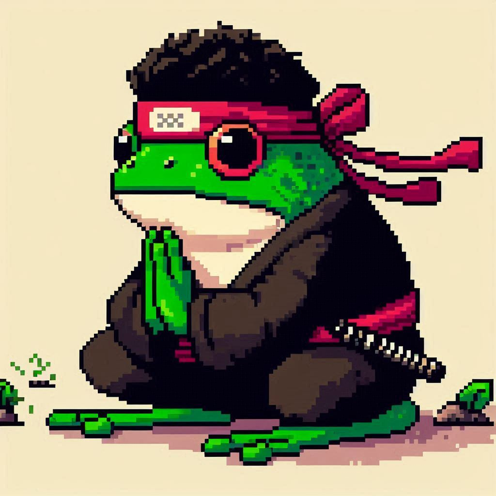
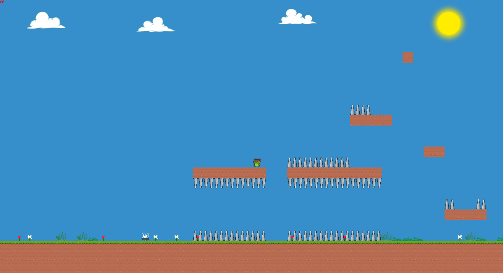
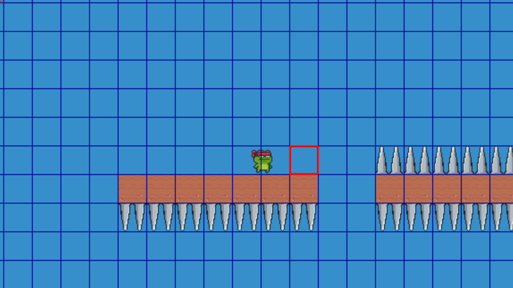

# 🎮 Adventure: Un juego con Pygame 🎮

  

Este es un juego de plataformas 2D desarrollado en Python con Pygame para el proyecto final de la asignatura optativa de Python "Este rifle tira cualquier cosa". 

## 🚀 Descripción del Juego

"Adventure: Un juego con Pygame" es un juego en el que el jugador controla un personaje que recorre un ambiente con una serie de obstáculos para llegar al transportador y salir de este entorno. La mecánica principal del juego se centra en la capacidad de saltar de manera simple y saltar en el aire del personaje para superar obstáculos.   

## 🛠️ Tecnologías Utilizadas

* **Python:** Lenguaje de programación principal.
* **Pygame:** Framework para desarrollo de juegos en Python.
* **JSON:** Formato de archivo utilizado para almacenar las configuraciones del juego y los datos de los niveles.
* **RBTree:** Biblioteca para árboles binarios, utilizada para optimizar la gestión de bloques del mundo del juego.

## 👨‍💻 Desarrollo del Juego

El juego se desarrolló a través de diferentes módulos que gestionan las funcionalidades principales:

* **Módulo adventure:** Contiene la clase principal Adventure, la cual gestiona la lógica del juego, el bucle de eventos, la carga de niveles, la gestión de la cámara, la interacción del personaje y el dibujo de los elementos del juego.
* **Módulo camera:** Define la clase Camera que se encarga de la gestión de la cámara, incluyendo el seguimiento del personaje, la gestión del área visible y la renderización del juego en la pantalla.
* **Módulo texture:**  Implementa la clase Texture, responsable de cargar y gestionar las texturas del juego, como las de los bloques, el personaje y los elementos del entorno.
* **Módulo character:** Contiene la clase Character, que representa al personaje del jugador, gestionando su movimiento, interacción con el entorno y la gestión de la animación del personaje.

Los niveles del juego se diseñaron con diferentes mecánicas de juego y se utilizaron archivos JSON para almacenar la información de los bloques, los objetos y la configuración de los niveles.

## 📸 Screenshots

**¡Mira cómo se ve el juego en acción!**

### 🕹️ Gameplay del juego:

  

### 🐛 Imagen del modo debug a pequeña escala:

  

### 🗺️ Imagen del modo debug a gran escala para observar todo el nivel:

  

## 🤩 Aspectos Destacados

* **Mecánica de juego única:** El salto doble ofrece una experiencia de juego innovadora y creativa.
* **Diseño de niveles desafiante:** Los niveles están diseñados para ofrecer una experiencia de juego desafiante y gratificante.
* **Uso de bibliotecas especializadas:** La implementación del juego se basa en bibliotecas especializadas que mejoran la eficiencia y el rendimiento del código.

## 🔮 Futuro del Juego

Se pueden considerar futuras mejoras para el juego:

* **Agregar más tipos de objetos y armas:** Ampliar la variedad de objetos que pueden existir en el juego y agregar algún tipo de arma para hacer el juego más movido.
* **Implementar un sistema de enemigos:** Incluir enemigos con diferentes comportamientos para aumentar la dificultad del juego.
* **Diseño de niveles más complejos:** Diseñar niveles más desafiantes con más puzzles y mecánicas de juego.

## 🙌 Contribuciones

Este proyecto es un esfuerzo individual, pero agradezco cualquier comentario o sugerencia para mejorarlo. Si tienes interés en contribuir al proyecto, no dudes en contactarme.

## ❤️ Agradecimientos

Un especial agradecimiento a la profesora [Sheyla](https://github.com/sheyls) por su dedicación y pasión al impartir la asignatura optativa de Python. Su enseñanza ha sido fundamental para mi desarrollo como programador y me ha inspirado a seguir aprendiendo en este apasionante campo. Ahora sé que puedo hacer casi cualquier cosa, solo necesito encontrar la librería adecuada. 😉 

Gracias por su tiempo, paciencia y por compartir su conocimiento con nosotros.
